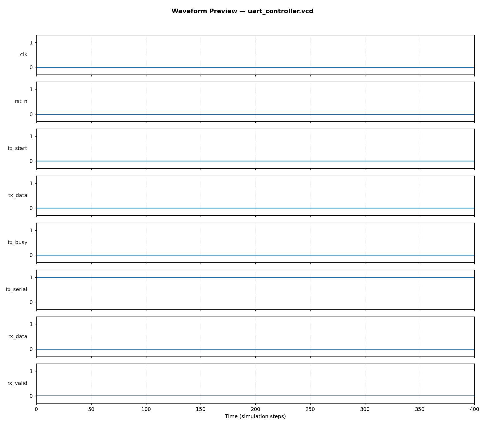

# UART Controller (TX + RX) — RTL Design & Verification

**Author:** Abhijit Karale
**Tools used:** SystemVerilog (IEEE 1800-2012), Icarus Verilog 12.0, Python/Matplotlib

## Overview
A UART (Universal Asynchronous Receiver/Transmitter) controller with
independent transmit and receive state machines sharing a common baud-rate
generator — 8 data bits, no parity, 1 stop bit. This is a direct bridge
project between embedded firmware (where UART is driven at the register/API
level) and RTL/DV (where the same protocol is verified bit-by-bit at the
serial-line level), reflecting hands-on firmware UART/SPI/I2C experience
applied at the hardware verification layer.

- **TX:** parallel-to-serial shift register with IDLE→START→DATA→STOP FSM
- **RX:** serial-to-parallel with mid-bit sampling for noise-tolerant start-bit
  detection, and frame-error detection (invalid stop bit)
- **Baud generator:** parameterizable clock-to-baud divider (`CLK_FREQ`, `BAUD_RATE`)

## Block Diagram
```
tx_data ──▶ [TX FSM: IDLE→START→DATA→STOP] ──▶ tx_serial ──┐
                                                             │ (loopback in tb)
rx_data ◀── [RX FSM: IDLE→START→DATA→STOP] ◀── rx_serial ◀─┘
                          ▲
                  shared baud-rate
                       generator
```

## Verification Approach
Self-checking SystemVerilog testbench (`tb/tb_uart_controller.sv`) with:
- **Loopback topology:** `tx_serial` wired directly to `rx_serial`, so every
  transmitted byte is independently re-received and checked bit-for-bit
- **Directed tests:** known byte patterns (0xA5, 0x00, 0xFF, 0x55) covering
  all-ones/all-zeros/alternating-bit edge cases
- **Constrained-random regression:** 40 randomized bytes
- **Result: 44/44 checks passed, 0 failures**

## Waveform


Full interactive waveform: `waveform/uart_controller.vcd` (open with GTKWave or any VCD viewer)

## How to Run
```bash
chmod +x run.sh
./run.sh
```
Requires: `iverilog`, `vvp` (Icarus Verilog), Python 3 with `matplotlib`.

## Repository Structure
```
03_uart_controller/
├── rtl/uart_controller.sv      # synthesizable RTL (TX FSM + RX FSM + baud gen)
├── tb/tb_uart_controller.sv    # self-checking loopback testbench
├── waveform/                   # VCD + PNG waveform preview
├── vcd_plot.py                 # waveform plotting utility
└── run.sh                      # one-command build+sim+plot
```

## Skills Demonstrated
`SystemVerilog` `UART Protocol` `RTL Design` `Functional Verification`
`Constrained-Random Testing` `Serial Protocol Debug` `Firmware-to-RTL Bridge Experience`
